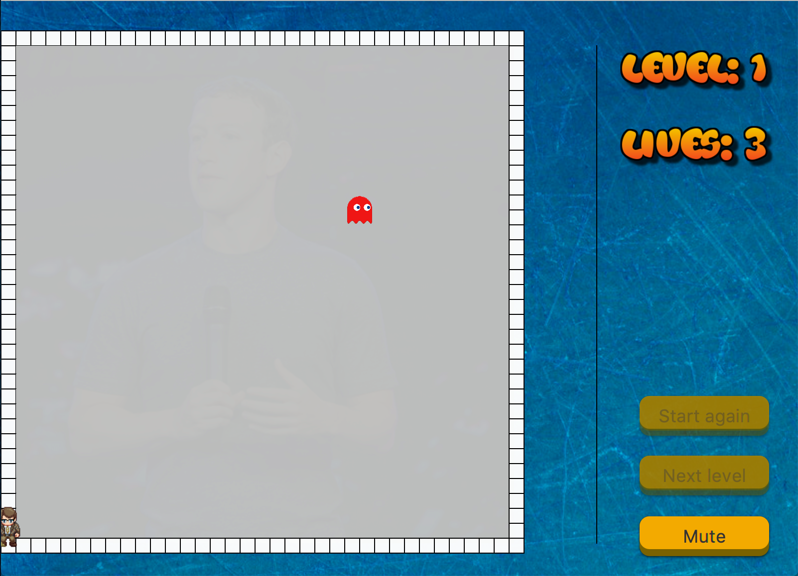

# Guess Who

## Required software and Installation

# Software:
*  Javafx was used to program the game so it can work on any device that have JDK(Java Development Kit)
* IDEA Software ex : IntelliJ .
# Installation:
1. Clone repository
2. Open the Src file  
3. Open Main.java file
4. Click Start button and the game will be ready to be played.

## Project description
The project is a game, which we have given the name Guess who. The game is based on a charachter that the player has to move around to reavel the picture behind. The player must make complete a closed shape to reveal the part of the picture that's behind that particular shape. The game also includes monsters that move around preventing the player from revealing the picture. The game has four levels comes with three difficutlies, easy, medium and hard.

## Winnig and Losing
The game can be won by finishing the four levels that the game has and revealing all the pictures. When the game start the player has three lives only which can be losed if the monster touchd the player character or the lines that the player is drawing beheind it.
Another way to lose a life is if the player touchd the line also.

## Picture from game

### Managing the project
 The issue tracker and milestone features inherent in the GitHub web interface were used ,in order to create all the functioanlity for the Game.
 The most important milestone for us were The game logic milestone which most of the issues were realted to. Other milestone were some features that we were not sure that we will have time to add them before the deadline like Music, Better design for the character and for the game to be runnable on Android.
